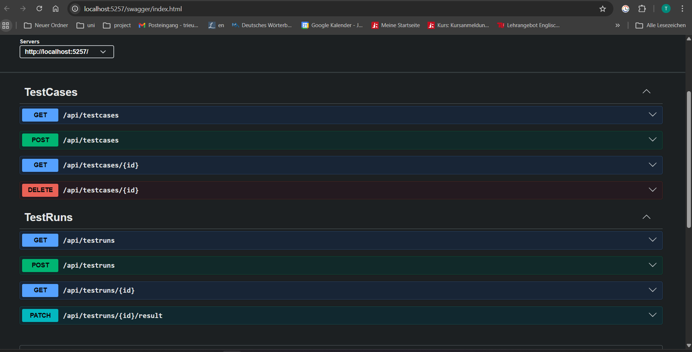

# Test Management Service
The Test Management Service is the coordinator of the whole framework. It manages:
- test case creation, retrieval, and deletion
- test run creation, retrieval, and result updates
- execution state (to be implemented)
- links to results from other services (to be implemented)

## Getting Started
### Prerequisites
- .NET 10 SDK
- Docker

### Database Setup 
- EF Core CLI tools: Install the EF Core CLI tools globally if you haven't already:
```bash
dotnet tool install --global dotnet-ef
```
- Start the PostgreSQL database:
```bash
docker compose up -d
```
- Apply database migrations to create the necessary tables:
```bash
# Create the initial migration and update the database
dotnet ef migrations add InitialCreate
dotnet ef database update
```

### Running the API 
- Start the API:
```bash
dotnet run dev
```

- The API will be available at `http://localhost:5257`
and the Swagger UI can be accessed at `http://localhost:5257/swagger`.


## Key Responsibilities
- list test cases/runs
- create a test case/run
- get one test case/run
- delete a test case
- update test run results
- execute a test run (to be implemented)
- update test run status (to be implemented)


## Architecture
### Data Models
This represents how data is stored in the database:
- TestCase: represents the definition of a test case
- TestRun: represents an execution of a test case
- 
### Dtos
We use Data Transfer Objects (DTOs) to decouple the API layer from the data 
models. This allows us to have more control over the data we expose through 
the API and to perform any necessary transformations.
This presents how data is transferred over HTTP:
- CreateTestCaseDto: used to create a new test case
- CreateTestRunDto: used to create a new test run
- TestCaseResponseDto: used to return test case details along with a summary of its associated test runs
- TestCaseSummaryDto: used to return a summary of a test case in the test run response
- TestRunResponseDto: used to return test run details along with the 
associated test case summary
- TestRunSummaryDto: used to return a summary of a test run in the test case response
- UpdateTestRunResultDto: used to update test run results

### Controllers
Controllers define the API endpoints and handle HTTP requests. They use the services to perform business logic and return appropriate HTTP responses:
- TestCasesController: handles endpoints related to test cases
- TestRunsController: handles endpoints related to test runs

## API Endpoints
Test cases:
- POST /api/testcases: create a new test case
- GET /api/testcases: list all test cases
- GET /api/testcases/{id}: get details of a specific test case
- (to be implemented) PUT /api/testcases/{id}: start a test run for the given test case
- DELETE /api/testcases/{id}: delete a test case

Test runs:
- POST /api/testruns: create a new test run for a given test case
- GET /api/testruns: list all test runs
- GET /api/testruns/{id}: get details of a specific test run
- (to be implemented) PATCH /api/testruns/{id}/status: update test run status
- PATCH /api/testruns/{id}/result: update test run results

## Techstack
- ASP.NET Core Web API
- PostgreSQL
- EF Core
- Swagger